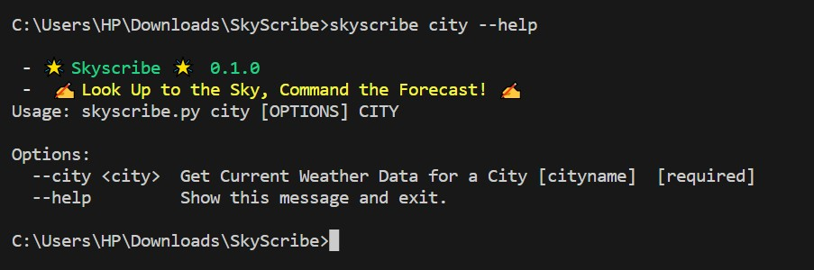
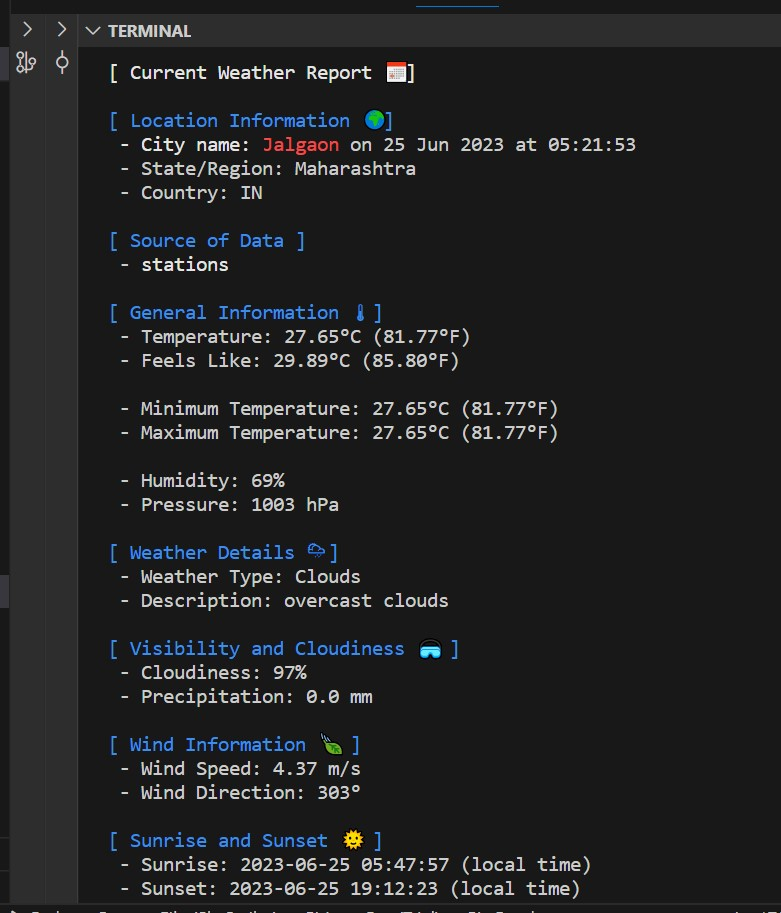

# SkyScribe
##  `Look Up to the Sky, Command the Forecast!`
## EXECUTION:
[](https://youtu.be/p7STVVIpHak)
## Outputs:



## Description

SkyScribe is a powerful weather tool that allows you to effortlessly access and control weather forecasts. With SkyScribe, you can uncover the secrets of the sky and stay ahead of changing weather conditions. This command-line utility tool, created using Python, provides a user-friendly interface to interact with weather data.

### Features

- **Single City Forecast**: Retrieve the weather report for a single city by passing the city name as a parameter.
- **Multiple City Forecast**: Fetch weather reports for multiple cities by providing multiple city names as parameters to the command.
- **Logging**: SkyScribe incorporates a logging module to maintain a log file (`weather.log`) that captures any encountered errors during the execution.
- **User-Friendly Output**: The tool generates well-formatted and easy-to-read weather reports, ensuring a seamless user experience.
- **Error Handling**: The code is equipped with robust error handling mechanisms to gracefully handle invalid parameters or API-related issues.
- **Command-Line Interface**: SkyScribe is designed as a command-line tool, providing a streamlined and efficient workflow for weather forecasting.

## Hackathon Project: Weather Forecasting Tool (Python)

SkyScribe was created as part of a hackathon project with the goal of developing a weather forecasting command line tool that demonstrates the capabilities of Python programming, API integration, data parsing, and error handling. The project leverages the OpenWeatherMap API to fetch weather data for the specified cities and utilizes Python to parse and present the information to the user.

### API: OpenWeatherMap

SkyScribe integrates the OpenWeatherMap API to retrieve weather data. OpenWeatherMap is a widely used weather data provider that offers a comprehensive set of APIs to access current weather conditions, forecasts, and historical weather data. By leveraging this API, SkyScribe ensures accurate and up-to-date weather information for the specified cities.

### GitHub Copilot

During the hackathon project, our team leveraged the AI-powered code completion tool, GitHub Copilot, to create a dynamic command-line tool. By simply commenting our desired functionality, Copilot provided accurate code suggestions for fetching APIs, optimizing code structure, and suggesting data parsing techniques. Its autocomplete capabilities and contextual understanding streamlined our workflow, improving productivity and allowing us to focus on core functionality. Copilot's optimized code generation and error handling suggestions proved invaluable, revolutionizing our coding experience and enabling us to deliver a robust tool in a shorter timeframe.

## Installation

To get started with SkyScribe, follow these steps:

1. Clone the repository:

   ```bash
   git clone https://github.com/Khushalsarode/SkyScribe-Weather-Forecast-clitool.git
   ```

2. Install the required packages by running the following command:

   ```bash
   pip install -r requirements.txt
   ```

3. Open the project folder in Microsoft Visual Studio Code (VS Code) or your preferred code editor.

4. Execute the main file `skyscribe.py` to start the program.


### Setup Instructions

To set up the SkyScribe project on your local machine, follow these steps:

 **Step 1: Install the Distribution Package**
 The generated distribution package can be distributed and installed on different machines. Users can install your package using pip with the following command:
 ```shell
   pip install /path/to/SkyScribe/dist/SkyScribe-1.0.tar.gz
   ```
   
   Make sure to replace `/path/to/SkyScribe/dist/SkyScribe-1.0.tar.gz` with the actual path to your distribution package file.

**Step 2: Install from PyPI**
   We have uploaded the package to PyPI (Python Package Index) to make it available for installation using pip from anywhere. Now users can install your package directly from

 PyPI using the following command:
   ```shell
   pip install SkyScribe
   ```
   Note: It's generally recommended to use a virtual environment (`myenv`) to isolate project dependencies and avoid conflicts.

## Usage

To use SkyScribe as a command-line tool, follow the instructions below:
- To get help and see available commands, run:

  ```bash
  skyscribe <command> --help
  ```
  Example: `skyscribe city --help`

- For a single city forecast, run the following command:

  ```bash
  skyscribe <command> "CityName" 
  ```
  Example: `skyscribe city Jalgaon`

  Replace `"City Name"` with the name of the city you want to retrieve the weather forecast for.

- For multiple city forecasts, run the following command:

  ```bash
  skyscribe <command> "City Name 1" "City Name 2" "City Name 3"
  ```
  Example: `skyscribe cities Jalgaon Pune Mumbai`

  Replace `"City Name 1"`, `"City Name 2"`, etc., with the names of the cities you want to retrieve the weather forecasts for.

The tool will display the weather forecasts for the specified cities in the command-line interface.

- For a single city that day weather forecast, run the following command:

  ```bash
  skyscribe <command> "CityName" 
  ```
  Example: `skyscribe today Jalgaon`
# SkyScribe WeatherApp Code Flow

The following is the architectural flow of the WeatherApp code:

1. Import required libraries and modules:
   - `datetime` for date and time operations
   - `os` for interacting with the operating system
   - `click` for creating command-line interfaces
   - `requests` for making HTTP requests
   - `logging` for logging application events
   - `dotenv` for loading environment variables from a file

2. Load environment variables using `dotenv` module:
   - The `load_dotenv()` function loads environment variables from a file into the application.

3. Get the API key from the environment variable:
   - The API key is stored in the `API_KEY` variable, retrieved from the environment variable.

4. Configure logging:
   - The `basicConfig()` function from the `logging` module is used to configure the logging settings.
   - The log file is set to `.\logs\weather.log`.
   - The log level is set to `INFO`, which logs all events with severity level INFO or higher.

5. Set tool information:
   - The tool name, version, and slogan are retrieved from environment variables (`TOOL_NAME`, `VERSION`, `SLOGAN`).
   - These variables are used to display information about the tool.

6. Define utility functions:
   - `kelvin_to_celsius_fahrenheit()` function converts temperature from Kelvin to Celsius and Fahrenheit.

7. Define the command-line interface using `click`:
   - The `cli()` function is decorated with `@click.group()` to create a command group.
   - The command group serves as the entry point for executing different commands.

8. Define commands:
   - The WeatherApp provides the following commands:
     - `city`: Get current weather data for a specific city.
     - `cities`: Get current weather data for multiple cities.
     - `today`: Get today's weather data for a specific city.

9. Implement the `city` command:
   - This command takes a city name as an argument.
   - It constructs the API request URL using the city name and API key.
   - It makes an HTTP request to the OpenWeatherMap API to get the weather data.
   - If the request is successful, it displays the location information and weather data.
   - If there is an error, it logs the error and displays an appropriate error message.

10. Implement the `cities` command:
    - This command takes multiple city names as arguments.
    - It iterates over the provided cities and performs the same steps as the `city` command for each city.
    - It collects the weather data for each city and stores it in a list.
    - After processing all cities, it displays the location information and weather data for each city.

11. Implement the `today` command:
    - This command is similar to the `city` command but specifically fetches today's weather data for a city.

12. Implement the `display_weather_data()` function:
    - This function takes the weather data response as input.
    - It extracts relevant information from the response and displays it using `click.echo()`.

13. Execute the command-line interface:
    - The `if __name__ == '__main__':` block ensures that the command-line interface is executed when the script is run directly.

This architectural flow describes how the WeatherApp code is structured and how it interacts with the OpenWeatherMap API to fetch and display weather data for cities.

#### Package Creation Process

To create the distribution package, follow these steps:

**Step 1: Create a setup.py File**
   In the root directory of your project (SkyScribe), create a file called `setup.py`. This file will contain the necessary information for packaging and distributing your project.
   Open `setup.py` in a text editor and add the following code:
   ```python
   from setuptools import setup, find_packages
   setup(
       name='SkyScribe',
       version='1.0',
       packages=find_packages(),
       entry_points={
           'console_scripts': [
               'skyscribe = skyscribe:cli',
           ],
       },
   )
   ```

   This code imports the `setup` function from the `setuptools` package and defines the package name, version, and entry point for the console script.

**Step 2: Build the Distribution Package**

   There are two ways to create a distributable package for your project:

   - **Way 1: Using setup.py**

     To create the distribution package using `setup.py`, open a terminal/command prompt and navigate to the root directory of your project (SkyScribe). Run the following command:

     ```shell
     python setup.py sdist bdist_wheel
     ```

     This command builds the distribution package in the `dist` directory. The package will be created in both source and wheel formats.

   - **Way 2: Using PyPI**

     To upload the package to PyPI, follow these steps:

     1. Create an account on PyPI (https://pypi.org/).
     2. Install the `twine` package:

        ```shell
        pip install twine
        ```

     3. Generate the distribution package again:

        ```shell
        python setup.py sdist bdist_wheel
        ```

     4. Upload the package to PyPI:

        ```shell
        twine upload dist/*
        ```

   Now your package will be available for installation using `pip install SkyScribe` from anywhere.

These instructions should help you set up the SkyScribe project on your local machine. If you have any further questions or need assistance, feel free to ask.


## Contributing

Contributions to SkyScribe are welcome! If you find any issues or have suggestions for improvements, please submit them through the GitHub repository. You can also contribute by opening pull requests with bug fixes, feature enhancements, or code optimizations.

Before contributing, please ensure that you have read the [Contribution Guidelines](CONTRIBUTING.md) for this project.

## License

SkyScribe is licensed under the [MIT License](LICENSE).

## Contact

For any questions, concerns, or feedback, please reach out

 to the project

 team at skyscribe@example.com.

---

Thank you for your interest in SkyScribe! We hope you find it useful for all your weather forecasting needs.
```
